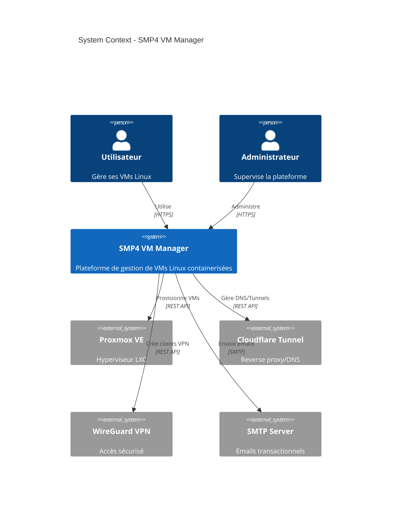
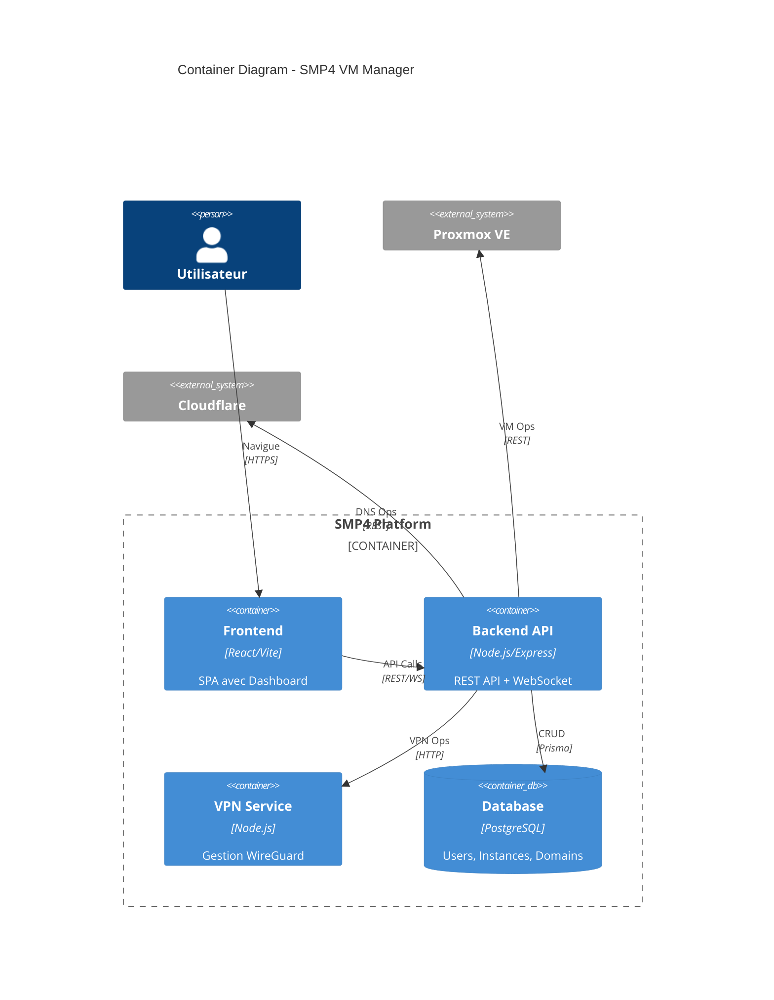
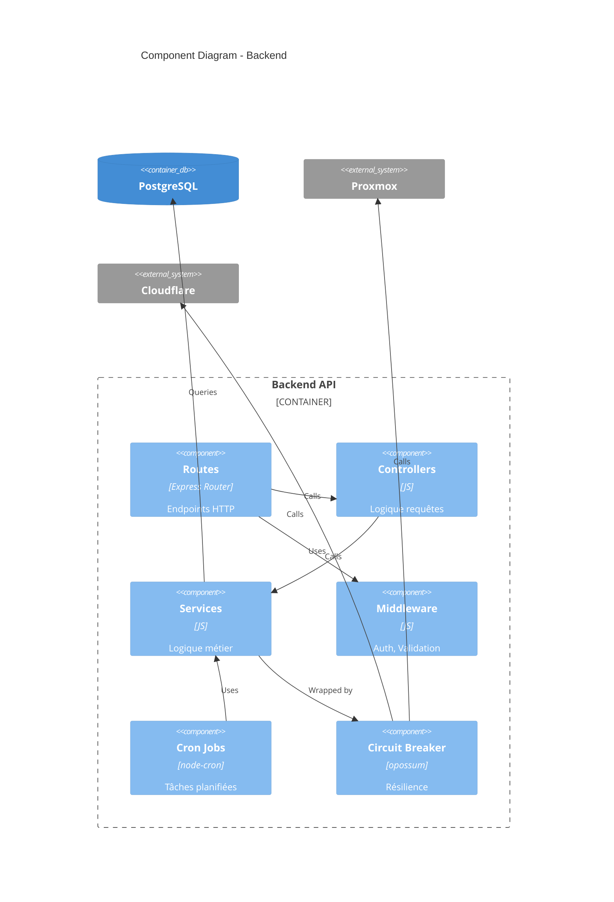
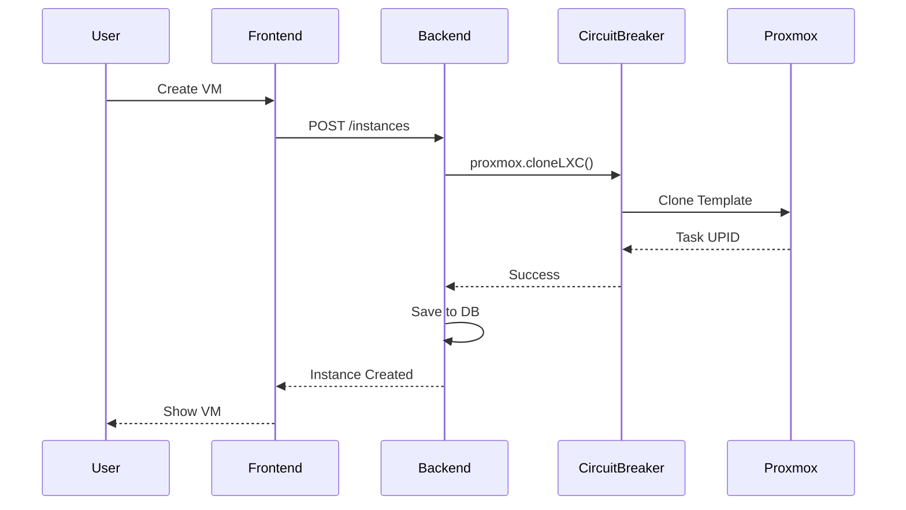

# SMP4 VM Manager - Architecture (C4 Model)

## Level 1: System Context

---

## Level 2: Container Diagram

---

## Level 3: Component Diagram (Backend)

---

## Services Architecture

| Service | Responsabilité | Dépendances |
|---------|---------------|-------------|
| `proxmox.service` | Opérations VM (start/stop/clone) | Proxmox API |
| `cloudflare.service` | Gestion tunnels/DNS | Cloudflare API |
| `vpn.service` | Clients WireGuard | VPN Service |
| `email.service` | Notifications | SMTP |
| `domain.service` | Sous-domaines | Cloudflare, DB |
| `instance.service` | Logique VM | Proxmox, DB |
| `ssh.service` | Terminal WebSocket | SSH |

## Data Flow

